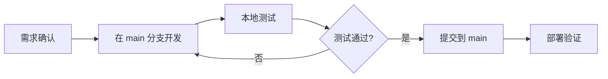
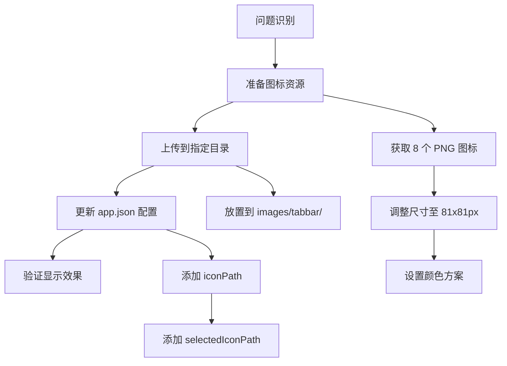
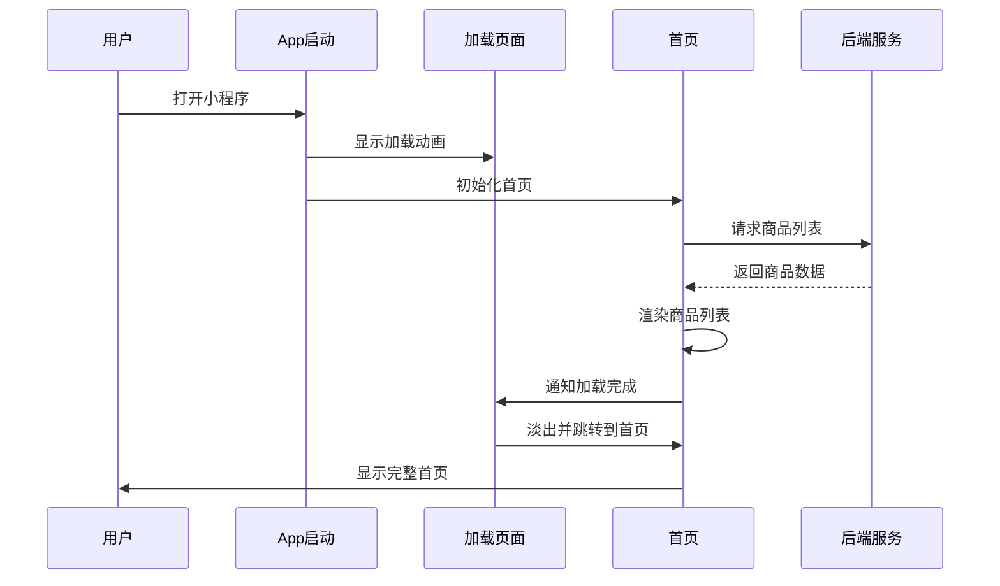
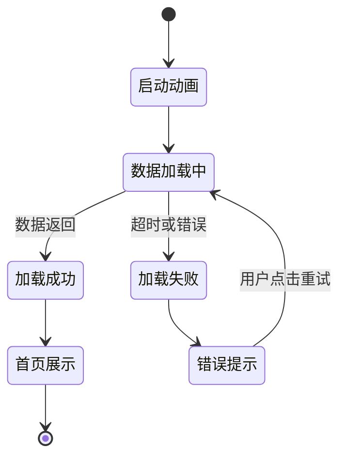
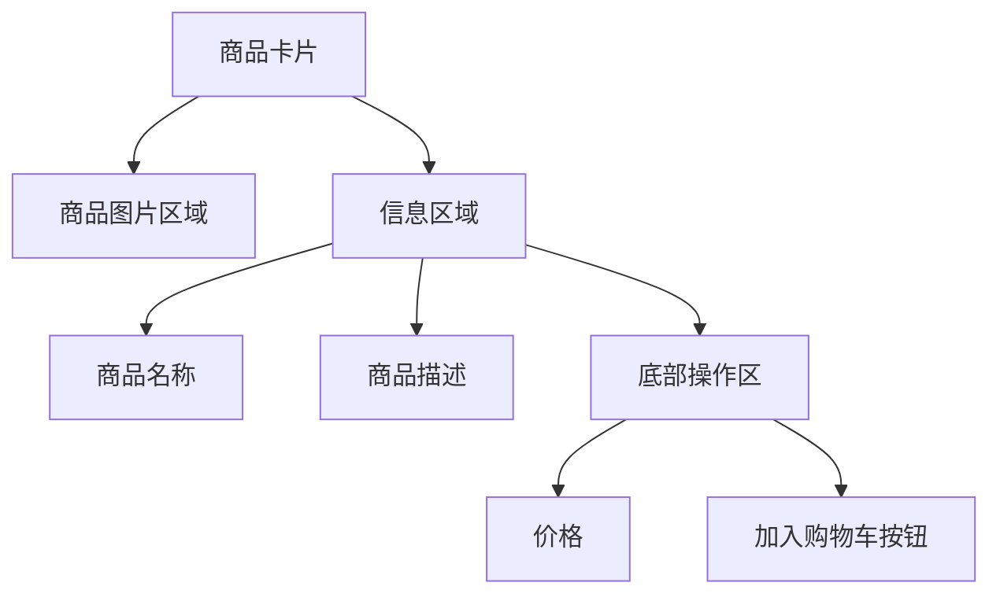

# Koman Coffee 小程序优化设计文档

## 1. 概述

### 1.1 设计目标

本设计文档旨在解决 Koman Coffee 咖啡点单小程序的四个核心优化问题：

1. **代码分支管理策略**：统一在 main 分支进行开发，简化协作流程
2. **TabBar 图标显示问题**：修复底部导航栏图标无法显示的缺陷
3. **启动加载体验优化**：在小程序启动时提供加载动画，提升用户体验
4. **界面视觉设计升级**：参考瑞幸咖啡等主流咖啡品牌小程序的设计风格，提升整体视觉质量

### 1.2 设计原则

- **用户体验优先**：所有优化均以提升用户使用流畅度和视觉满意度为核心
- **实用性导向**：避免过度设计，保持功能的简洁和高效
- **品牌一致性**：在参考业界标准的同时，保持 Koman Coffee 的品牌特色
- **渐进式优化**：优先解决阻塞性问题（如 TabBar 显示），再进行体验增强

---

## 2. 代码分支管理策略

### 2.1 分支策略定义

项目采用**单分支开发模式**，所有代码提交、功能开发、缺陷修复均在 `main` 分支执行。

### 2.2 适用场景

| 场景类型 | 操作方式 |
|---------|---------|
| 新功能开发 | 直接在 main 分支提交 |
| 缺陷修复 | 直接在 main 分支提交 |
| 样式调整 | 直接在 main 分支提交 |
| 配置更新 | 直接在 main 分支提交 |
| 重构优化 | 直接在 main 分支提交 |

### 2.3 开发流程



### 2.4 提交规范

为确保 main 分支的提交历史清晰可追溯，建议采用以下提交信息格式：

| 类型 | 格式 | 示例 |
|------|------|------|
| 功能 | `feat: 功能描述` | `feat: 添加启动加载动画` |
| 修复 | `fix: 问题描述` | `fix: 修复 TabBar 图标不显示问题` |
| 样式 | `style: 样式描述` | `style: 优化首页商品卡片视觉设计` |
| 重构 | `refactor: 重构描述` | `refactor: 优化购物车数据结构` |
| 文档 | `docs: 文档描述` | `docs: 更新开发指南` |

---

## 3. TabBar 图标显示问题修复方案

### 3.1 问题分析

#### 3.1.1 根本原因

当前 `app.json` 配置中的 `tabBar.list` 项缺少 `iconPath` 和 `selectedIconPath` 字段，导致底部导航栏无法显示图标，仅显示文字。

#### 3.1.2 现状确认

| 检查项 | 当前状态 | 期望状态 |
|--------|---------|---------|
| TabBar 配置 | 仅有文字配置 | 包含图标路径配置 |
| 图标文件 | 仅有占位文件 | 实际 PNG 图标文件 |
| 显示效果 | 仅显示文字标签 | 显示图标 + 文字 |

### 3.2 解决方案架构



### 3.3 图标资源规范

#### 3.3.1 图标清单

需要准备以下 8 个图标文件：

| 序号 | 文件名 | 功能说明 | 颜色要求 | 尺寸要求 |
|------|--------|---------|---------|---------|
| 1 | `home.png` | 首页-默认态 | 深灰色 #999999 | 81×81 px |
| 2 | `home-active.png` | 首页-选中态 | 咖啡色 #6B4423 | 81×81 px |
| 3 | `order.png` | 订单-默认态 | 深灰色 #999999 | 81×81 px |
| 4 | `order-active.png` | 订单-选中态 | 咖啡色 #6B4423 | 81×81 px |
| 5 | `cart.png` | 购物车-默认态 | 深灰色 #999999 | 81×81 px |
| 6 | `cart-active.png` | 购物车-选中态 | 咖啡色 #6B4423 | 81×81 px |
| 7 | `user.png` | 我的-默认态 | 深灰色 #999999 | 81×81 px |
| 8 | `user-active.png` | 我的-选中态 | 咖啡色 #6B4423 | 81×81 px |

#### 3.3.2 图标设计指南

| 设计维度 | 规范要求 |
|---------|---------|
| 格式 | PNG（支持透明背景） |
| 文件大小 | 单个不超过 40KB |
| 风格 | 线性或面性，保持统一 |
| 辨识度 | 图形简洁，功能指向明确 |
| 品牌调性 | 符合咖啡行业温暖、舒适的氛围 |

#### 3.3.3 图标获取渠道

| 渠道名称 | 特点 | 推荐度 |
|---------|------|-------|
| 阿里巴巴 Iconfont | 免费、资源丰富、可自定义颜色 | ⭐⭐⭐⭐⭐ |
| IconPark（字节跳动） | 免费、现代风格、颜色可调 | ⭐⭐⭐⭐ |
| Flaticon | 资源多、部分免费 | ⭐⭐⭐ |

### 3.4 配置更新方案

#### 3.4.1 app.json 修改内容

在 `app.json` 的 `tabBar.list` 中为每个页面添加图标路径配置：

| 页面 | iconPath 字段值 | selectedIconPath 字段值 |
|------|----------------|------------------------|
| 首页 | `images/tabbar/home.png` | `images/tabbar/home-active.png` |
| 订单 | `images/tabbar/order.png` | `images/tabbar/order-active.png` |
| 购物车 | `images/tabbar/cart.png` | `images/tabbar/cart-active.png` |
| 我的 | `images/tabbar/user.png` | `images/tabbar/user-active.png` |

#### 3.4.2 验证步骤

1. 确认 8 个图标文件已上传至 `web/customer/images/tabbar/` 目录
2. 确认 app.json 已更新配置
3. 在微信开发者工具中清除缓存并重新编译
4. 检查底部 TabBar 是否正常显示图标
5. 点击切换不同 Tab，验证选中态图标是否正确高亮

---

## 4. 启动加载动画设计方案

### 4.1 设计目标

在用户打开小程序时，在首页内容加载完成之前，展示一个品牌化的加载动画，提升等待体验，避免白屏或内容闪烁。

### 4.2 加载流程设计



### 4.3 技术实现策略

#### 4.3.1 加载状态管理

| 状态阶段 | 描述 | 触发时机 |
|---------|------|---------|
| 启动初始化 | 显示加载动画 | app.onLaunch 执行时 |
| 数据加载中 | 持续显示动画 | 首页发起数据请求 |
| 加载完成 | 隐藏动画，显示内容 | 首页数据渲染完成 |
| 异常处理 | 显示错误提示 | 网络请求失败 |

#### 4.3.2 加载动画实现方式

| 实现方式 | 优点 | 缺点 | 推荐度 |
|---------|------|------|-------|
| CSS动画 + loading组件 | 性能好、体积小 | 样式需定制 | ⭐⭐⭐⭐⭐ |
| Lottie动画 | 视觉效果好、可复用 | 需引入库、文件稍大 | ⭐⭐⭐⭐ |
| GIF动画 | 简单易用 | 清晰度低、体积大 | ⭐⭐ |

**推荐方案**：使用 CSS 动画 + 微信小程序原生组件实现轻量级加载动画。

### 4.4 视觉设计元素

#### 4.4.1 加载动画组成

| 元素 | 描述 | 设计建议 |
|------|------|---------|
| 品牌 Logo | Koman Coffee 标识 | 居中显示，尺寸约 80-100px |
| 动画效果 | 旋转咖啡杯或渐变进度条 | 循环播放，时长 1-1.5秒 |
| 加载文案 | "加载中..." 或 "正在准备您的咖啡" | 位于动画下方，字号 14px |
| 背景颜色 | 品牌色或浅色调 | #F5F5F5 或 #FFF9F0 |

#### 4.4.2 动画样式参考

| 动画类型 | 描述 | 适用场景 |
|---------|------|---------|
| 旋转式 | 咖啡杯图标旋转 | 品牌感强，常见于餐饮类 |
| 进度条 | 横向或圆形进度条 | 用户明确感知加载进度 |
| 渐变闪烁 | Logo 透明度渐变 | 简洁优雅，适合轻量级 |
| 骨架屏 | 模拟内容布局的灰色占位 | 减少感知等待时间 |

**推荐方案**：旋转咖啡杯 + 文字提示，符合品牌特性且实现简单。

### 4.5 性能优化策略

#### 4.5.1 加载时长控制

| 场景 | 最小显示时长 | 最大等待时长 | 超时处理 |
|------|------------|-------------|---------|
| 数据快速返回 | 800ms | - | 正常进入首页 |
| 数据正常返回 | 自动匹配 | 5秒 | 正常进入首页 |
| 网络异常 | - | 5秒 | 显示错误提示，允许重试 |

#### 4.5.2 数据预加载策略

| 数据类型 | 加载时机 | 缓存策略 |
|---------|---------|---------|
| 商品列表 | 首页 onLoad | 缓存 5 分钟 |
| 分类数据 | 首页 onLoad | 缓存 30 分钟 |
| 用户信息 | app.onLaunch | 持久化存储 |
| 购物车 | app.onLaunch | 持久化存储 |

### 4.6 交互流程设计



---

## 5. 界面视觉设计升级方案

### 5.1 参考对象分析

#### 5.1.1 瑞幸咖啡设计特点

基于瑞幸咖啡小程序的视觉风格，提炼以下设计要点：

| 设计维度 | 瑞幸咖啡特点 | 应用到 Koman Coffee |
|---------|------------|-------------------|
| 配色方案 | 蓝色主色调（品牌色），白色为主背景 | 咖啡棕色主色调 #6B4423，米白色背景 #FFF9F0 |
| 首页布局 | 顶部轮播图 + 分类快捷入口 + 商品列表 | 保留分类筛选 + 商品卡片网格布局 |
| 商品卡片 | 大图展示 + 名称 + 价格 + 加入购物车按钮 | 优化卡片阴影、圆角、图片比例 |
| 字体层级 | 清晰的标题、副标题、正文层级 | 采用字号 32/28/24/20 的层级体系 |
| 交互反馈 | 明显的按钮状态、点击动效 | 添加按钮 hover 态、点击波纹效果 |

#### 5.1.2 主流咖啡小程序共性

| 设计元素 | 行业共性 | Koman Coffee 策略 |
|---------|---------|-------------------|
| 色彩基调 | 温暖色系（棕、米、橙） | 采用咖啡棕 #6B4423 为主色 |
| 产品图片 | 高清大图，占据卡片主要面积 | 图片比例 16:9 或 1:1，最小宽度 200px |
| 价格显示 | 突出显示，使用品牌色或红色 | 使用咖啡棕色，字号加大至 28-32px |
| 操作按钮 | 圆角矩形，颜色醒目 | 圆角 8px，主按钮使用品牌色 |
| 留白处理 | 充足的间距，提升呼吸感 | 卡片间距 16px，内边距 24px |

### 5.2 整体视觉规范

#### 5.2.1 色彩系统

| 颜色类型 | 颜色值 | 应用场景 |
|---------|-------|---------|
| 主色调 | #6B4423 | 品牌元素、主按钮、选中态 |
| 辅助色 | #8B5A2B | 次级按钮、图标高亮 |
| 背景色 - 主 | #FFFFFF | 卡片背景、弹窗背景 |
| 背景色 - 辅 | #FFF9F0 | 页面整体背景 |
| 文字 - 主 | #333333 | 标题、重要信息 |
| 文字 - 辅 | #666666 | 正文、描述 |
| 文字 - 弱 | #999999 | 次要信息、占位符 |
| 边框色 | #EEEEEE | 分割线、卡片边框 |
| 成功色 | #52C41A | 成功提示、库存充足 |
| 警告色 | #FAAD14 | 警告提示、库存不足 |
| 错误色 | #F5222D | 错误提示、售罄 |

#### 5.2.2 字体规范

| 字体层级 | 字号（rpx） | 字重 | 应用场景 |
|---------|-----------|------|---------|
| 一级标题 | 36 | Bold (700) | 页面主标题 |
| 二级标题 | 32 | Medium (500) | 模块标题、商品名称 |
| 三级标题 | 28 | Medium (500) | 卡片标题、分类名称 |
| 正文 | 28 | Normal (400) | 商品描述、订单详情 |
| 辅助文字 | 24 | Normal (400) | 提示信息、副标题 |
| 说明文字 | 20 | Normal (400) | 标签、时间戳 |

#### 5.2.3 间距系统

| 间距级别 | 数值（rpx） | 应用场景 |
|---------|-----------|---------|
| 超小间距 | 8 | 文字与图标间距 |
| 小间距 | 16 | 卡片内元素间距 |
| 中间距 | 24 | 卡片内边距、按钮内边距 |
| 大间距 | 32 | 模块间距、页面边距 |
| 超大间距 | 48 | 区块分隔 |

#### 5.2.4 圆角规范

| 元素类型 | 圆角值（rpx） |
|---------|-------------|
| 小按钮、标签 | 8 |
| 普通按钮、输入框 | 12 |
| 卡片 | 16 |
| 图片容器 | 12 |
| 模态框 | 24 |

### 5.3 页面级设计优化

#### 5.3.1 首页（index）优化要点

| 优化项 | 当前问题 | 优化方案 |
|-------|---------|---------|
| 商品卡片样式 | 样式过于简单，缺少视觉层次 | 添加阴影、圆角、优化图片比例至 1:1 |
| 分类筛选区域 | 分类标签样式不突出 | 改为横向滚动标签组，选中态添加背景色和边框 |
| 加载状态 | 无明确加载提示 | 添加骨架屏或加载动画 |
| 商品图片 | 可能未设置默认图 | 提供默认占位图，处理图片加载失败 |
| 布局方式 | 未优化展示密度 | 采用两列网格布局，间距 16rpx |

**视觉布局结构**：

```mermaid
graph TD
    A[首页] --> B[顶部导航栏]
    A --> C[分类筛选区]
    A --> D[商品列表区]
    
    C --> C1[横向滚动分类标签]
    C1 --> C2[全部 | 美式 | 拿铁 | 摩卡 | 卡布奇诺]
    
    D --> D1[商品卡片网格 2列]
    D1 --> D2[商品图片]
    D1 --> D3[商品名称]
    D1 --> D4[商品描述]
    D1 --> D5[价格 + 加入购物车按钮]
```

#### 5.3.2 商品详情页优化要点

| 优化项 | 优化方案 |
|-------|---------|
| 图片展示 | 顶部大图，宽高比 4:3，支持轮播多张图 |
| 价格显示 | 大号字体，咖啡色高亮，前置货币符号 |
| 规格选择 | 卡片式选项组，选中态边框高亮 |
| 定制选项 | 分组展示（温度、甜度、奶量），图标辅助说明 |
| 操作按钮 | 底部固定，区分"加入购物车"和"立即购买" |

#### 5.3.3 购物车页面优化要点

| 优化项 | 优化方案 |
|-------|---------|
| 商品列表 | 左侧缩略图 + 右侧信息，支持左滑删除 |
| 数量调节 | 步进器组件，限制最小值 1 |
| 价格汇总 | 底部固定区域，清晰展示小计、折扣、总价 |
| 空状态 | 友好的空购物车插图和引导文案 |

#### 5.3.4 订单页面优化要点

| 优化项 | 优化方案 |
|-------|---------|
| 订单卡片 | 清晰区分订单状态（待支付/制作中/已完成），使用颜色标签 |
| 时间信息 | 显示预计完成时间，倒计时提示 |
| 操作按钮 | 根据状态动态显示（支付、取消、评价） |

### 5.4 组件级设计优化

#### 5.4.1 商品卡片组件（product-card）

**优化要素**：

| 元素 | 设计规范 |
|------|---------|
| 容器 | 白色背景，圆角 16rpx，阴影 0 4rpx 12rpx rgba(0,0,0,0.08) |
| 图片 | 宽高比 1:1，圆角 12rpx，懒加载 |
| 商品名称 | 字号 28rpx，字重 500，颜色 #333，最多显示 2 行，超出省略 |
| 商品描述 | 字号 24rpx，颜色 #999，最多显示 1 行 |
| 价格 | 字号 32rpx，字重 700，颜色 #6B4423，前置 "¥" 符号 |
| 加购按钮 | 圆形或圆角方形，咖啡色背景，白色"+"图标 |

**布局示意**：



#### 5.4.2 定制选项组件（custom-options）

**优化要素**：

| 选项类型 | 展示方式 |
|---------|---------|
| 温度选择 | 横向排列，卡片样式，图标+文字 |
| 甜度选择 | 横向排列，卡片样式，文字描述 |
| 容量选择 | 横向排列，卡片样式，突出推荐项 |
| 选中状态 | 边框高亮（咖啡色），背景色淡化 |

#### 5.4.3 订单项组件（order-item）

**优化要素**：

| 元素 | 设计规范 |
|------|---------|
| 容器 | 白色背景，底部边框 1rpx #EEE |
| 缩略图 | 尺寸 120rpx × 120rpx，圆角 12rpx |
| 商品信息 | 名称 + 定制选项，颜色区分层级 |
| 状态标签 | 圆角 8rpx，不同状态不同背景色 |

### 5.5 交互细节优化

#### 5.5.1 点击反馈

| 交互元素 | 反馈方式 |
|---------|---------|
| 按钮 | 按下时背景色加深 10%，或添加阴影 |
| 卡片 | 点击时轻微缩放（scale: 0.98） |
| 列表项 | 背景色变为 #F5F5F5 |

#### 5.5.2 状态提示

| 状态类型 | 提示方式 |
|---------|---------|
| 加载中 | 显示加载动画或骨架屏 |
| 成功操作 | Toast 提示，1.5秒自动消失 |
| 错误操作 | 红色 Toast，或 Modal 提示 |
| 空状态 | 插图 + 友好文案 + 操作引导 |

#### 5.5.3 动画效果

| 动画场景 | 效果描述 | 时长 |
|---------|---------|------|
| 页面切换 | 淡入淡出 | 300ms |
| 列表项出现 | 从下至上滑入 | 200ms |
| 模态框弹出 | 缩放 + 淡入 | 250ms |
| 按钮点击 | 轻微缩放 | 150ms |

### 5.6 视觉资源准备清单

| 资源类型 | 数量 | 规格要求 | 用途 |
|---------|------|---------|------|
| TabBar 图标 | 8个 | 81×81 px, PNG | 底部导航栏 |
| 品牌 Logo | 2个 | 透明背景，SVG 或高清 PNG | 启动页、导航栏 |
| 默认商品图 | 1个 | 400×400 px | 图片加载失败占位 |
| 空状态插图 | 3个 | 宽度 400-600rpx | 空购物车、空订单、网络错误 |
| 加载动画 | 1个 | Lottie 或 GIF | 启动加载 |

---

## 6. 实施优先级与验收标准

### 6.1 实施优先级

| 优先级 | 任务项 | 理由 |
|-------|-------|------|
| P0（最高） | TabBar 图标显示修复 | 影响基础使用体验，属于阻塞性缺陷 |
| P1（高） | 启动加载动画 | 提升首次进入体验，减少白屏感知 |
| P2（中） | 首页商品卡片样式优化 | 提升核心页面视觉质量 |
| P3（低） | 其他页面样式优化 | 逐步完善整体视觉 |

### 6.2 验收标准

#### 6.2.1 TabBar 图标显示

| 检查项 | 验收标准 |
|-------|---------|
| 图标显示 | 4 个 Tab 均显示图标，图标清晰无模糊 |
| 状态切换 | 点击切换 Tab 时，选中态图标正确高亮为咖啡色 |
| 颜色准确性 | 默认态灰色 #999999，选中态咖啡色 #6B4423 |
| 跨设备兼容 | 在 iOS 和 Android 设备上显示一致 |

#### 6.2.2 启动加载动画

| 检查项 | 验收标准 |
|-------|---------|
| 动画显示 | 小程序启动时自动显示加载动画 |
| 动画流畅性 | 动画循环播放，无卡顿 |
| 最小显示时长 | 即使数据快速返回，也至少显示 800ms |
| 超时处理 | 5 秒后仍未加载完成，显示错误提示并允许重试 |
| 过渡自然 | 从加载页到首页的过渡平滑（淡出效果） |

#### 6.2.3 视觉设计升级

| 检查项 | 验收标准 |
|-------|---------|
| 色彩一致性 | 所有页面使用统一的色彩规范 |
| 字体层级 | 标题、正文、辅助文字字号符合规范 |
| 间距统一 | 卡片、按钮、模块间距符合设计规范 |
| 圆角一致 | 所有圆角元素使用规定的圆角值 |
| 交互反馈 | 所有可点击元素有明确的点击反馈 |

### 6.3 测试场景

| 测试场景 | 测试步骤 | 预期结果 |
|---------|---------|---------|
| 冷启动 | 首次打开小程序 | 显示加载动画 → 加载完成后进入首页 → TabBar 显示正确 |
| 热启动 | 后台切回前台 | 直接显示之前页面，TabBar 正常 |
| 网络异常 | 关闭网络后启动 | 加载动画显示 → 5秒后提示网络错误 → 可点击重试 |
| Tab 切换 | 依次点击 4 个 Tab | 图标状态正确切换，页面内容正常加载 |
| 商品浏览 | 浏览首页商品列表 | 卡片样式美观，间距统一，图片清晰 |

---

## 7. 设计文档版本信息

| 项目 | 内容 |
|------|------|
| 文档版本 | v1.0 |
| 创建日期 | 2024-01-15 |
| 适用分支 | main |
| 涉及模块 | 小程序顾客端（web/customer） |
| 设计状态 | 待评审 |


